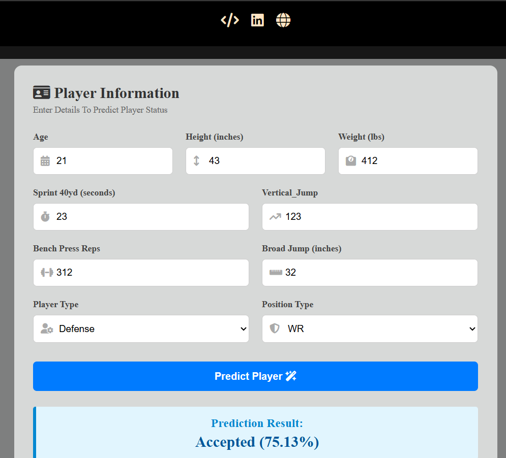
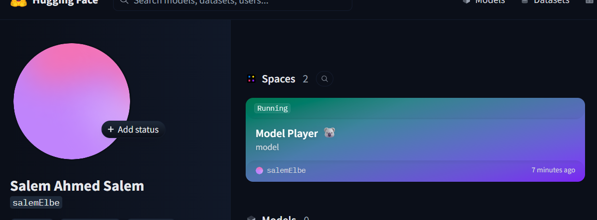

# Player Status Prediction Project

This project is a Full-Stack Machine Learning application designed to predict player acceptance status based on their physical performance and attributes.

# First STEP
# This Takes The Most TiME About 7.5 hrs
## 1. Machine Learning Model Phase
* Developed a predictive model using Python within a Jupyter Notebook.
* Processed and cleaned the player dataset to prepare it for training.
* Built a custom data transformation pipeline (My_Transform) to calculate engineered features such as Body Mass Index (BMI).
* Trained an XGBoost classifier to achieve high accuracy in predicting player outcomes.
* Exported the final trained pipeline and model into a serialized file named `xgb_final_pipeline_deploy.pkl`.

## 2. Back-End API Phase
* Created a robust backend web service using the FastAPI framework in Python.
* Defined the data schema requirements for incoming requests using Pydantic models.
* Integrated the custom transformation pipeline and loaded the saved model using Joblib.
* Configured Cross-Origin Resource Sharing (CORS) middleware to allow secure communication with the frontend.
* Exposed a POST endpoint at `/model` that receives player data, processes it via the pipeline, executes the model prediction, and returns the result with probability percentages.

## 3. Front-End Phase
* Developed a user-friendly interface using semantic HTML5, stylized with CSS3.
* Designed a responsive registration form that collects player information including Age, Height, Weight, Sprint, Vertical Jump, Bench Press, Broad Jump, Player Type, and Position Type.
* Utilized FontAwesome icons to enhance input fields and form elements.
* Implemented JavaScript (main.js) to capture form submission events asynchronously using the Fetch API.
* Added functions in JavaScript to prevent default page reloads and dynamically display prediction outcomes (Accepted / Not Accepted) inside the UI.

## 4. Deployment Phase
* Successfully deployed the entire Python backend environment onto Hugging Face Spaces using a Docker container.
* Created a configuration `Dockerfile` to set up the Python environment and automatically install essential data science packages including Pandas, Scikit-Learn, and XGBoost.
* Successfully resolved server memory and storage limitations by shifting the environment configuration from Serverless to Containerized architecture.
* Connected the frontend JavaScript logic to communicate directly with the live Hugging Face production URL endpoint.

--- 

## Tech Stack

- Machine Learning: Python, XGBoost, Scikit-Learn, Pandas, Jupyter Notebook
- Back-End: Python, FastAPI, Joblib, Pydantic
- Front-End: HTML5, CSS3, JavaScript, FontAwesome
- Deployment: Hugging Face Spaces, Docker

## Installation

To run the project locally:

- Clone the repository
- Install the required packages

# Screen Shoots

* In the navbar there is important links 

* API deployment

# Source of the data

* Iam In GCI World Course and this course from tokyo university and I get this data I worked on it to do this project 
